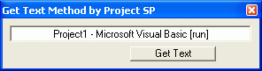

<div align="center">

## Get Text Method by Project SP


</div>

### Description

A Simple API Method Of Getting Text From Your Selected Window...
 
### More Info
 


<span>             |<span>
---                |---
**Submitted On**   |
**By**             |[Salman Paji](https://github.com/Planet-Source-Code/PSCIndex/blob/master/ByAuthor/salman-paji.md)
**Level**          |Beginner
**User Rating**    |5.0 (10 globes from 2 users)
**Compatibility**  |VB 6\.0
**Category**       |[Windows API Call/ Explanation](https://github.com/Planet-Source-Code/PSCIndex/blob/master/ByCategory/windows-api-call-explanation__1-39.md)
**World**          |[Visual Basic](https://github.com/Planet-Source-Code/PSCIndex/blob/master/ByWorld/visual-basic.md)
**Archive File**   |[](https://github.com/Planet-Source-Code/salman-paji-get-text-method-by-project-sp__1-58167/archive/master.zip)

### API Declarations

```
Option Explicit
Private Declare Function FindWindow Lib "user32" Alias "FindWindowA" (ByVal lpClassName As String, ByVal lpWindowName As String) As Long
Private Declare Function FindWindowEx Lib "user32" Alias "FindWindowExA" (ByVal hWnd1 As Long, ByVal hWnd2 As Long, ByVal lpsz1 As String, ByVal lpsz2 As String) As Long
Private Declare Function SendMessageString Lib "user32" Alias "SendMessageA" (ByVal hwnd As Long, ByVal wMsg As Long, ByVal wParam As Long, ByVal lParam As String) As Long
Private Const WM_GETTEXT = &HD
```


### Source Code

```
Private Function ProjectSPGetText(Window2GetTextFrom As Long) As String
Dim GetBanner As String * 256
If Window2GetTextFrom <> 0 Then
Call SendMessageString(Window2GetTextFrom, WM_GETTEXT, 256, GetBanner)
'Gets The Text, And Saves The Text in a String Called : GetBanner
DoEvents
'This Make Sure That The GetText Method Is Completed Before The Next Step
ProjectSPGetText = GetBanner
'Then This Shows The Saved String From The GetText Method And Shows in The Text Box, Or You Can Also Use a RichTextBox
Else
MsgBox "The Room Window Or Control Is Not Open...", vbInformation
'If The Room is Not Open, This Messege Will Popup as a Information
End If
End Function
```

